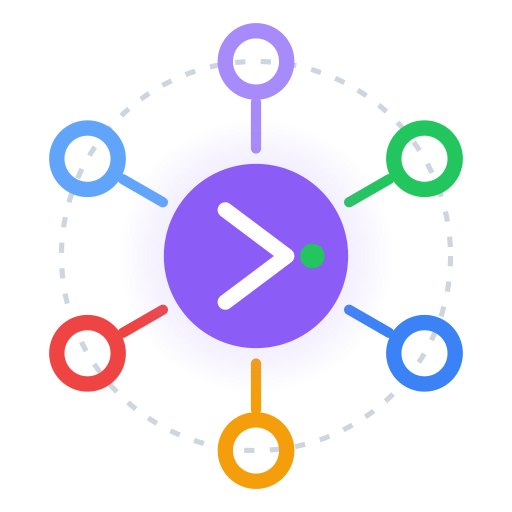

<p align="center">
  
</p>

<h1 align="center">APICircle Studio</h1>

<p align="center">
  <strong>A Git-native, AI-native API workspace.</strong><br />
  Build, test, mock, and ship APIs — collaborate through pull requests,<br />
  and let any AI client drive your workspace.
</p>

<p align="center">
  <a href="https://github.com/apicircle/studio/actions/workflows/ci.yml"></a>
  <a href="https://github.com/apicircle/studio/actions/workflows/e2e.yml"></a>
  =20" />
  
  <a href="LICENSE"></a>
</p>

---

APICircle Studio is an API client in the spirit of Postman and Insomnia —
rebuilt around two ideas the others miss:

1. **Your workspace is a Git repo.** Collections, environments, and mock
   definitions are plain JSON, pushed to your own GitHub repo on a working
   branch. Teams collaborate the way they collaborate on code: branches, diffs,
   pull requests, review.
2. **Your workspace is an AI tool catalog.** A built-in Model Context Protocol
   (MCP) server exposes **71 tools**, so Claude, ChatGPT, Cursor, Copilot, and
   any other MCP client can read, author, and run requests for you.

No cloud account. No vendor lock-in. Your data stays on your machine and in
your repo.

---

## Why APICircle Studio

- **Own your data.** The workspace is JSON you can read, diff, and back up.
  Secrets are encrypted locally (AES-GCM via WebCrypto; wrapped by the OS
  keychain on desktop). Nothing is uploaded to a third-party server.
- **Collaborate through pull requests.** Auto-create a working branch from
  `main`, push to save, and open a PR straight from the app. API collections
  get the same review workflow as your code.
- **AI-native, not AI-bolted-on.** The MCP server is a first-class surface, not
  a plugin. An assistant can scan a codebase, propose a request collection,
  generate runnable client code, spin up a mock from a spec — all without
  leaving the chat.
- **Runs everywhere you do.** Desktop app, browser, CLI, and embeddable npm
  packages — all sharing one engine, one workspace format, one mutation API.
- **Built on open standards.** Model Context Protocol for AI, Git for sync,
  OpenAPI / Postman / Insomnia / HAR for import. No proprietary formats to get
  trapped in.

## Features

### Git-backed workspaces

A workspace is two JSON documents — `workspace.synced.json` (the shared
collection tree, environments, mocks, releases) and `workspace.local.json`
(per-device runtime: history, sessions, UI state). The synced document is
pushed to a GitHub repo on a working branch; teammates pull, branch, and merge
it like any other file. Per-connection release management supports both
private collections and a public marketplace.

### AI integration via MCP

The bundled `@apicircle/mcp-server` speaks the open
[Model Context Protocol](https://modelcontextprotocol.io) over stdio, so it
works with **Claude Desktop, Claude Code, ChatGPT, GitHub Copilot, Cursor,
Continue, Cline, Zed, Windsurf**, and anything else that supports MCP. Its
71-tool catalog covers request/folder CRUD, environment authoring, assertions,
execution plans, history, mock-server lifecycle, codebase scanning, imports,
code generation, and prompt-driven (natural-language) authoring.

### Local mock servers

Point APICircle at an OpenAPI / Swagger / Postman / Insomnia file and get a
running HTTP mock on `localhost` in seconds. The Hono-based engine handles
`$ref` dereferencing, per-endpoint overrides (flip a `200` to a `503` to test
error paths), conditional response rules, request validation, and response
multipliers. Mock _definitions_ live in the synced workspace so teammates share
them; _runtime_ state stays local.

### A complete request toolkit

- **17 authentication schemes**, all end-to-end functional — Bearer, Basic,
  API key, custom header, the full OAuth2 grant set (client credentials, auth
  code, PKCE, password, implicit, device flow, with auto-refresh), AWS SigV4,
  Digest, NTLM, Hawk, and JWT. Signing primitives are verified against the
  relevant RFC / NIST reference vectors.
- **Import what you already have** — cURL commands, OpenAPI/Swagger, Postman
  collections, Insomnia exports, and HAR files.
- **Generate client code** from any saved request — cURL, fetch, Node (axios),
  Python (requests), Go, and Rust.
- **Environments** with priority ordering and cross-workspace variable sources.
- **Assertions** and multi-step **execution plans** to chain requests.
- **Request history** with full headers, body previews, and assertion results.

### Use it your way

| Surface          | Best for                                     |
| ---------------- | -------------------------------------------- |
| **Desktop app**  | Day-to-day development (Windows/macOS/Linux) |
| **Web app**      | Quick access, zero install                   |
| **CLI**          | CI pipelines, terminals, headless agents     |
| **npm packages** | Embedding the engine in your own tooling     |

## Quick start

### Desktop app

Download the installer for your OS from the
[latest release](https://github.com/apicircle/studio/releases/latest), then see
[`docs/installing.md`](docs/installing.md) for the one-time setup step.

### Run from source

Requires Node ≥ 20 and pnpm ≥ 9.

```bash
pnpm install
pnpm dev:web            # web app → http://localhost:5174
```

### CLI

```bash
# Spin up a mock server from an OpenAPI spec
npx @apicircle/cli mock ./openapi.yaml

# Start the MCP server against a workspace folder
npx @apicircle/cli mcp --workspace ./my-workspace

# Import a spec into a workspace
npx @apicircle/cli import ./postman_collection.json

# Run a saved execution plan headlessly and report pass/fail
npx @apicircle/cli run "Smoke Tests" --reporter junit
```

## Connect your AI client

Install the MCP server and point your client at it:

```bash
npm install -g @apicircle/mcp-server
```

```jsonc
// e.g. Claude Desktop's claude_desktop_config.json
{
  "mcpServers": {
    "apicircle": {
      "command": "apicircle-mcp",
      "args": ["--workspace", "/absolute/path/to/your/workspace"],
    },
  },
}
```

Full per-client instructions (Cursor, Copilot, ChatGPT, Continue, Cline, Zed,
Windsurf, generic stdio) are in
**[Connect your AI client](docs/connect-your-ai-client.md)**.

## How it works

Every write to a workspace — from the UI, the CLI, or an AI tool call — funnels
through a single mutation API (`applyMutation`) in `@apicircle/core`. That means
an AI agent can never produce workspace state the UI couldn't have produced, and
vice versa. The same parsers, the same Hono mock engine, and the same workspace
format back all four surfaces. See
[`docs/architecture/platform.md`](docs/architecture/platform.md) for the full
design record.

## Project status — Early Access

APICircle Studio is **pre-launch and self-funded**. Expect rough edges and
occasional breaking changes before v1.0. The desktop builds are currently
**unsigned** (code-signing certificates are not yet funded), so the first
launch triggers a one-time OS security prompt — [`docs/installing.md`](docs/installing.md)
walks through it. Builds are produced in the open by this repo's GitHub Actions.
Issues and feedback are very welcome:
[github.com/apicircle/studio/issues](https://github.com/apicircle/studio/issues).

## Documentation

- [Connect your AI client](docs/connect-your-ai-client.md)
- [Mock server guide](docs/mock-server.md)
- [MCP tool catalog reference](docs/mcp-tools-reference.md)
- [Authentication — the 17-scheme matrix](docs/auth.md)
- [Platform architecture (MCP, mock engine, CLI, desktop)](docs/architecture/platform.md)
- [Installing the desktop app](docs/installing.md)
- [QA — coverage status & E2E CI](docs/qa/README.md)

## Repository layout

```
apps/
  web/                  Vite + React shell — the browser build
  desktop/              Electron shell — mock + MCP bridges, OS-keychain secrets
packages/
  ui-components/        React UI + Zustand store + IndexedDB persistence
  core/                 Request execution, auth signing, assertions, mutation API
  shared/               Types, generateId, validators, encryption helpers
  git/                  GitHub API client + sync logic
  mock-server-core/     Hono mock-server engine + OpenAPI/Postman/Insomnia parsers
  mcp-server/           stdio MCP host with the 71-tool catalog
  cli/                  `apicircle` binary — mock / mcp / import / run subcommands
```

`@apicircle/{shared,core,mock-server-core,mcp-server,cli}` are published to npm;
`apps/*` and the `git` / `ui-components` packages are workspace-private.

## Develop

```bash
pnpm install            # install workspace deps
pnpm dev:web            # web dev server → http://localhost:5174
pnpm dev                # turbo dev (all apps)
pnpm build              # turbo build
pnpm check              # typecheck (tsc --noEmit per package)
pnpm lint               # eslint
pnpm test               # vitest unit tests
pnpm test:e2e           # Playwright E2E (web)
```

Desktop: `pnpm --filter @apicircle/desktop build`, then `… start`.

## License

APICircle Studio is released under a **custom source-available license** — the
source is open to read, study, and contribute to, but this is _not_ an
OSI-approved open-source license. It is free for personal, educational, and
non-commercial use (plus a 30-day commercial evaluation period); ongoing
commercial use requires a separate license. See [`LICENSE`](LICENSE) for the
full terms, or contact **apicircle365@gmail.com** for commercial licensing.
